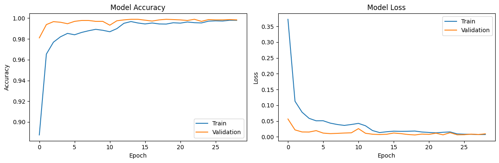
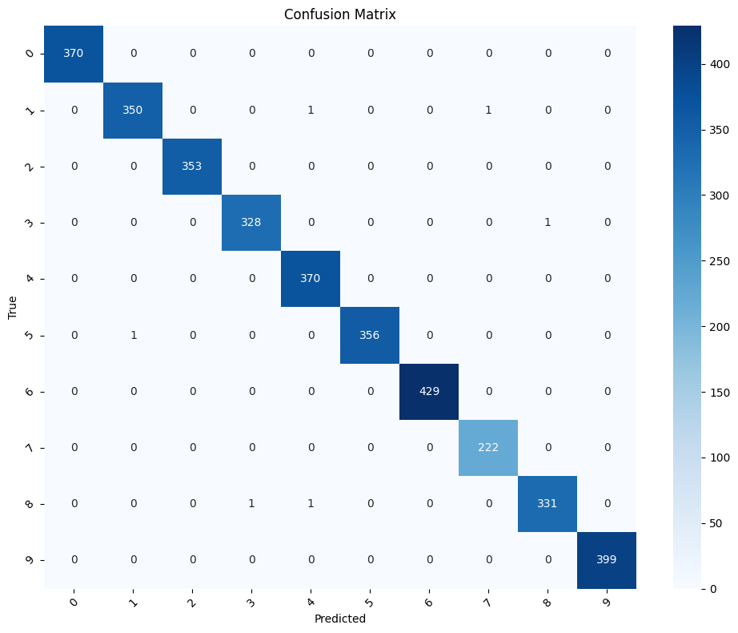

**Hand Gesture Recognition System**
===================================

A real-time AI-powered system that recognizes static hand gestures using a webcam and maps them to predefined computer actions. Built with TensorFlow, MediaPipe, OpenCV, and Streamlit, the system provides smooth, touch-free interaction and acts as a complete machine-learning pipeline from data collection to real-time prediction and monitoring.

* * * * *

⭐ **Features**
--------------

### **Recognized Gestures**

| Gesture | Action |
| --- | --- |
| Palm | Next slide |
| Palm Moved | Previous slide |
| Fist | Play / Pause |
| Fist Moved | Next track |
| Thumb | Previous track |
| Down | ALT + F4 (close window) |
| Index | Mouse movement |
| C | Mouse movement + selection |
| L | Scroll up |
| OK | Scroll down |

* * * * *

🧠 **Technical Overview**
-------------------------

### **Model Approach**

Instead of training directly on raw images, we:

-   Extracted **21 3D hand landmarks** using MediaPipe.

-   Used their coordinates as model input.

-   Trained a lightweight **ANN (DNN)** to classify gestures.

This solved many issues such as lighting differences, background noise, and data leakage.

### **Main Technologies**

-   **TensorFlow / Keras** -- model building & training

-   **MediaPipe** -- hand landmark detection

-   **OpenCV** -- webcam input & live frame rendering

-   **Streamlit** -- web interface

-   **PyAutoGUI** -- executing gesture-linked actions

-   **MLflow** -- experiment tracking

-   **Logging module** -- model monitoring

* * * * *

📂 **Project Pipeline**
-----------------------

### **1\. Data Collection & Preprocessing**

-   Built a custom data collection script to capture images at **224×224×3**.

-   Created a balanced dataset: **10 classes × ~2200 images each (≈26k total)**.

-   Applied segmentation, normalization, and augmentation.

-   Extracted hand landmarks to use as training features.

### **2\. Model Development, Training & Evaluation**

-   Built a Fully Connected Deep Neural Network (DNN).

-   Input size: **63 features** (21 landmarks × 3 coords).

-   Techniques used: **BatchNorm, Dropout, normalization scaling**.

-   Achieved **99.8% validation accuracy**.

-   Stored artifacts:

    -   `hand_gesture_norm_model.pkl`

    -   `scaler.pkl`

-   Visualizations (accuracy, loss curves, confusion matrix) included.

### **3\. Real-Time Detection & Applications**

-   `realtime_detection.py`: real-time webcam prediction with overlay.

-   `main.py`: Streamlit interface with:

    -   Start/Stop camera

    -   Predictions panel

    -   Top-3 probable classes

    -   Clear history

-   `realtime_gesture_controller.py`: extended version enabling:

    -   Scrolling

    -   Mouse control

    -   Slide navigation

    -   Music control

    -   Window closing via gestures

### **4\. MLOps & Monitoring**

-   Tracked:

    -   Parameters

    -   Metrics

    -   Artifacts

    -   Model versions

-   Continuous monitoring script logs:

    -   Model confidence

    -   Prediction patterns

    -   Potential issues

-   Runtime logs saved in CSV format.

* * * * *

🚀 **How to Run the Application**
---------------------------------

### **1\. Install Dependencies**

Make sure Python 3.10+ is installed.

`pip install -r requirements.txt`

or manually:

`pip install tensorflow mediapipe opencv-python streamlit`

* * * * *

### **2\. Run the Streamlit Interface**

`streamlit run main.py`

**Controls:**

-   **Start Camera** --- Begin recognition

-   **Stop Camera** --- End recognition

-   **Clear History** --- Reset prediction smoothing

-   **Predictions panel** --- Shows gesture name + confidence

* * * * *

### **3\. Run the Real-Time Gesture Controller (Optional)**

`python realtime_gesture_controller.py`

This mode triggers actual **system actions** such as:

-   Scrolling

-   Next/Previous track

-   Mouse cursor control

-   Slide navigation

-   Window closing

* * * * *

📊 **Project Visuals**
----------------------


<p align="center">
  
  <br>
  <em>Model Accuracy vs Model Loss</em>
</p>

<p align="center">
  
  <br>
  <em>Confusion Matrix</em>
</p>


* * * * *


🧩 **Project Structure**
------------------------

```text
├── data/
├── hand_gesture_norm_model.pkl
├── scaler.pkl
├── segment_image.py
├── main.py
├── actions.py
├── Data Preprocessing.ipynb
├── Model_Training.ipynb
├── realtime_detection.py
├── realtime_gesture_controller.py
├── monitoring_module.py
├── Monitoring Data.csv
├── mlflow_log_model.py
├── requirements.txt
├── .gitignore
└── README.md
```


* * * * *

📦 **Dataset**
--------------

A fully custom dataset created by the team.\
Includes both **original images** and **segmented versions**.\
You can check it out from [here](https://drive.google.com/drive/folders/1zCutwpwdeeVWlWYR6Le6BQ7oPeqA-ZOH?usp=sharing).


* * * * *

🧪 **Model Performance**
------------------------

-   **Accuracy:** 99.8%

-   **Robust landmark-based approach**

-   **Stable learning (loss ≈ 0.01)**

-   **Strong diagonal dominance in confusion matrix**

* * * * *

🎯 **Summary**
--------------

This system successfully integrates:

-   Custom dataset creation

-   Feature extraction with MediaPipe

-   High-accuracy DNN classification

-   Real-time control via webcam

-   Streamlit UI for interaction

-   MLOps tracking and continuous monitoring

It demonstrates a complete, production-oriented machine learning pipeline enabling intuitive, touch-free human-computer interaction.
